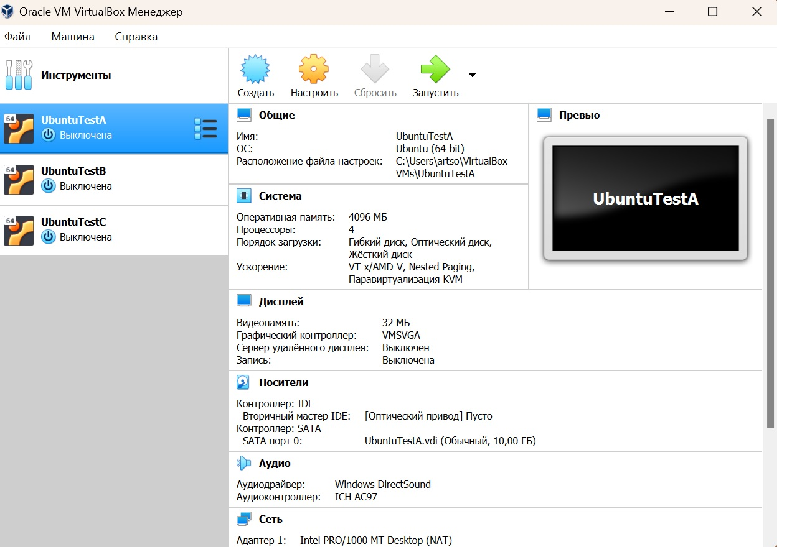
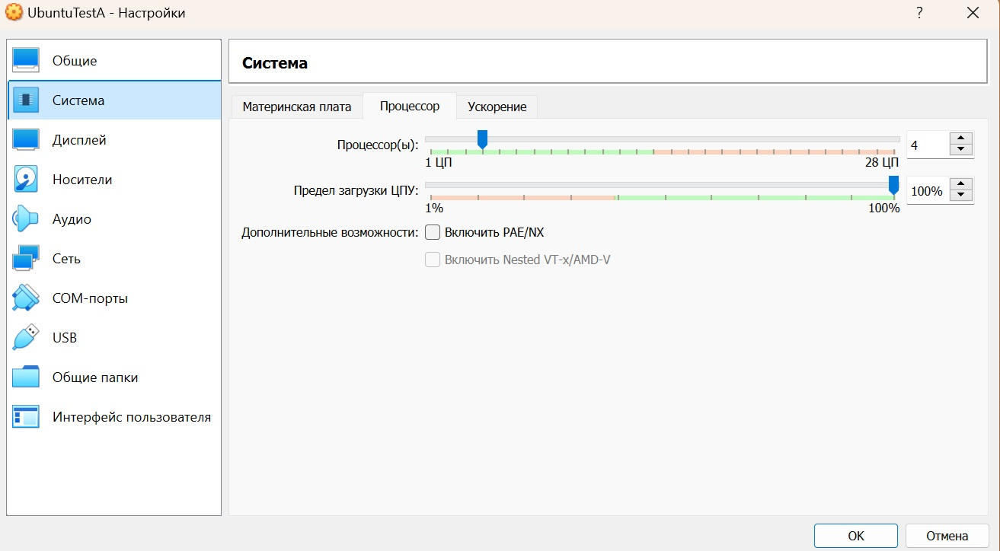
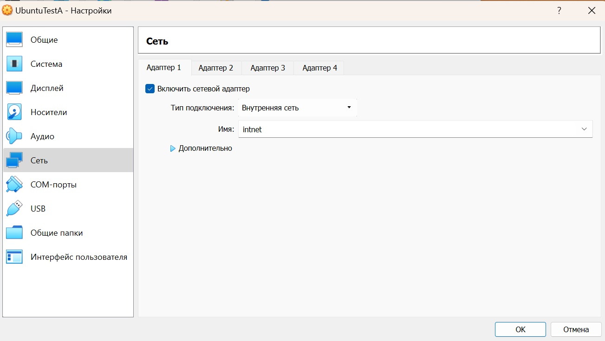
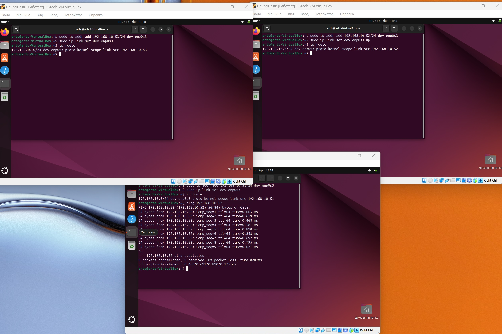
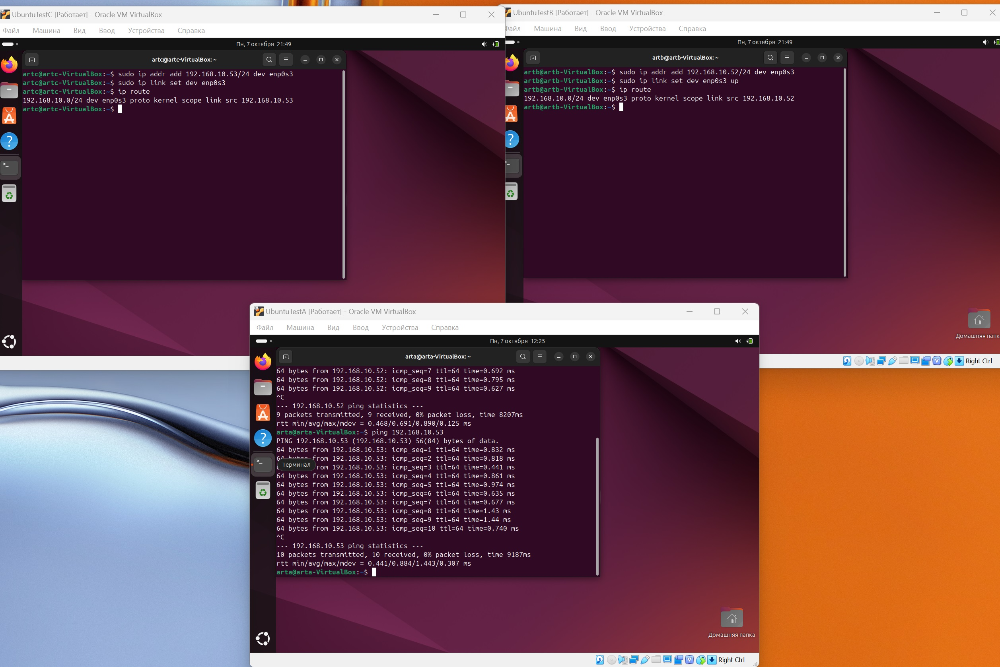
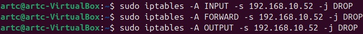

# Лабораторная работа №3. Виртуализация

## Шаги выполнения

### Скачивание VirtualBox и создание виртуальных машин

Я скачал установил VirtualBox. В программе я создал 3 виртуальные машины, на которые поставил Ubuntu, предварительно скачав образ с официального сайта.

### Настройка виртуальных машин

Каждой машине я выделил 4Гб ОЗУ, дал 4 ядра, а также настроил внутреннюю сеть

### Назначение IP-адресов виртуальным машинам

С помощью команды `sudo ip addr add 192.168.10.51/24 dev enp0s3` добавляю IP-адрес и включаю его командой `sudo ip link set dev enp0s3 up`. С помощью `ip route` проверяю IP-адрес. Делаю так для каждой машины

### Сетевой доступ между A и B

С помощью команды `ping` проверяю доступ из машины А к машине В

### Сетевой доступ между A и C

С помощью команды `ping` проверяю доступ из машины А к машине C

### Запрет доступа для машины В к машине С

С помощью команд `sudo iptables -A INPUT -s 192.168.10.52 -j DROP`, `sudo iptables -A FORWARD -s 192.168.10.52 -j DROP`, `sudo iptables -A OUTPUT -s 192.168.10.52 -j DROP` блокирую соединение.

### Вывод

Научился работать с виртуальными машинами, настраивать соединение между ними
