# Лабораторная работа №4

## Шаги выполнения

### Установка Docker, создание Dockerfile и сборка образа

Я скачал и установил Docker. В PyCharm я создал Dockerfile, в который написал код, установив нужные библиотеки
Командой `docker build -t aafire-container .` собрал образ
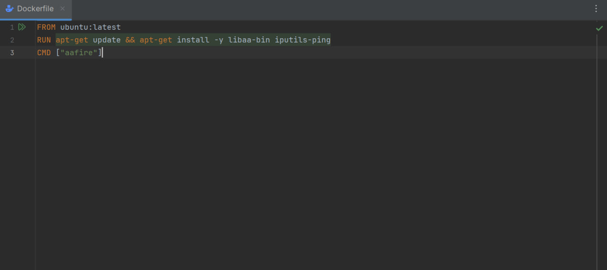

### Запуск контейнера

Командой `docker run -it --name aafire1 aafire-container` запустил первый контейнер
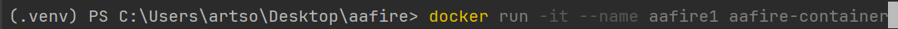
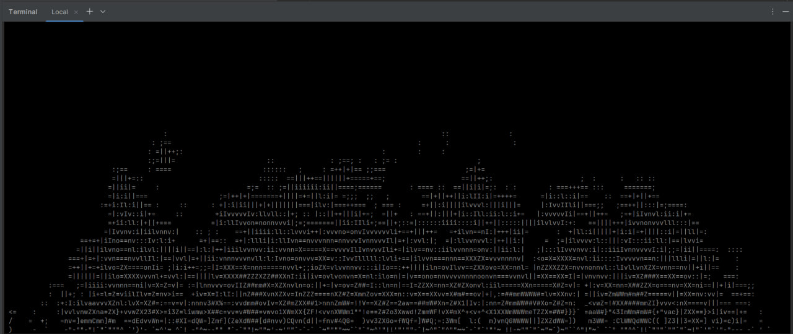

### Сборка и запуск второго контейнера

Таким же образом создаю и запускаю второй контейнер
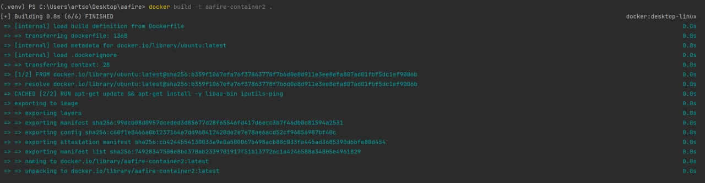
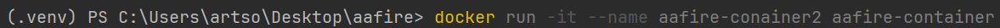
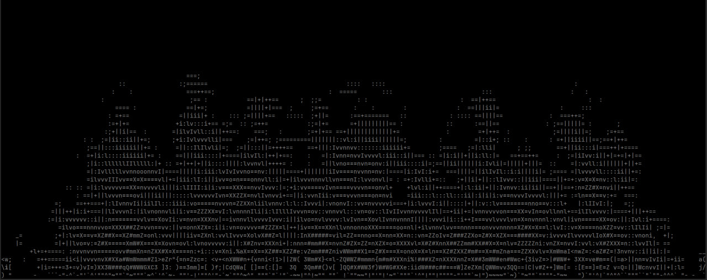

### Запущенные контейнеры

С помощью команды `docker ps` видно запущенные контейнеры
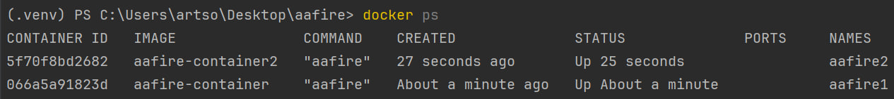

### Подключение

Командой `docker network create Network` создаю сеть, подключаю контейнеры к этой сути
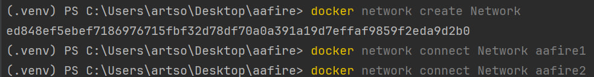

### Настройки сети и соединение

Командой `docker network inspect Network` смотрю IP-адреса контейнеров. Тестирую соединение между контейнерами командой `ping`
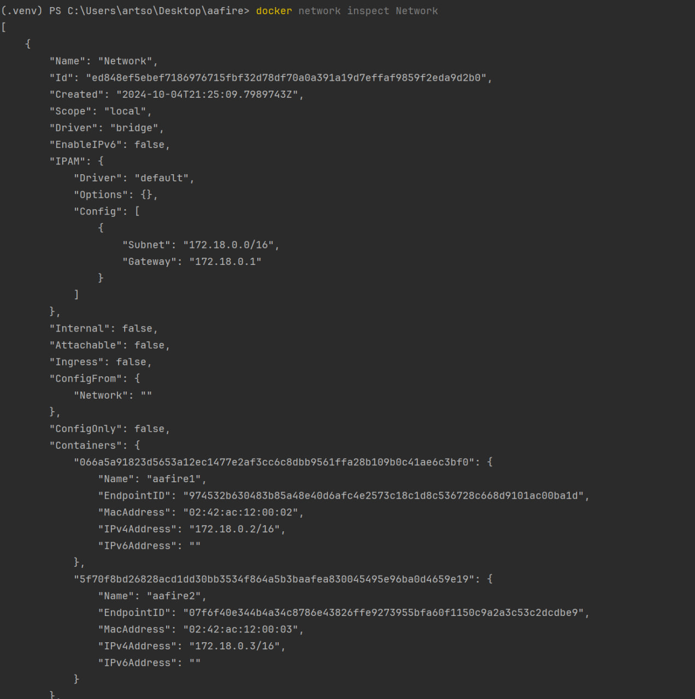
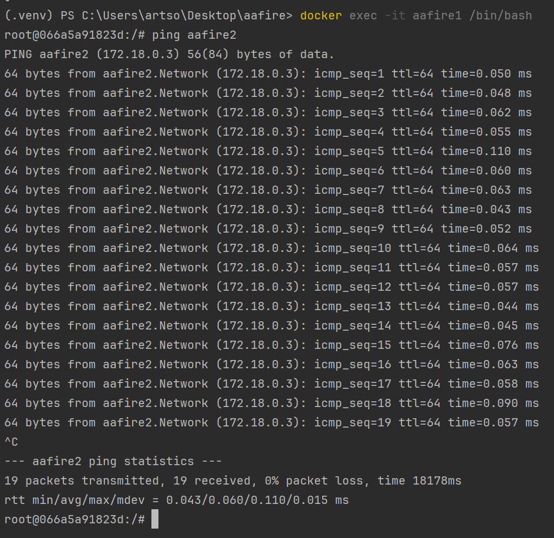
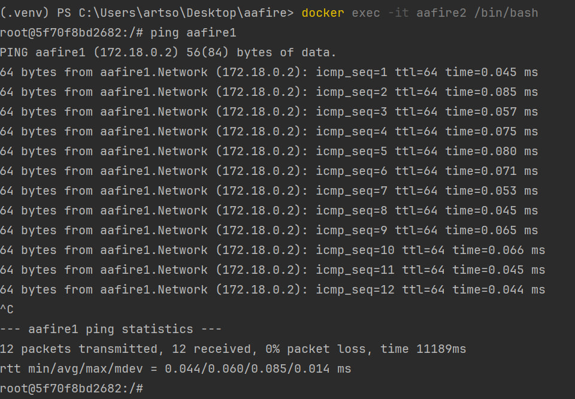

### Вывод

Научился работать с докером, создавать и настраивать контейнеры.
